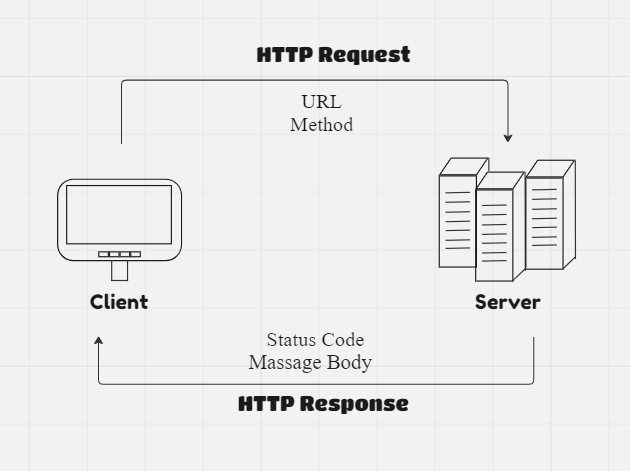
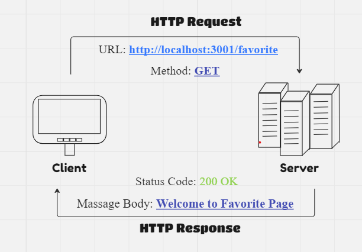

<!-- Project Name - Project Version -->
# Movies-Library - v1.0

<!-- Author Name -->
* Ragahd Al-Katout

<!-- WRRC -->
## WRRC

<!-- WRRC Example -->
* WRRC Example:


## Overview 
    This project is a movie app that allows users to check the latest movies based on categories.


## Getting Started
<!-- The steps that a user must take in order to build this app on their own machine and get it running -->
To run this project locally, follow these steps:

1. clone the repository:
    ```
    git@github.com:Raghadkatout08/Movies-Library.git
    ```

2. Open VS Code.

3. Initialize the project:
    ``` 
    npm init -y 
    ```
4. Create an  ```server.js``` file, (name is optional).

5. Install Express Package: 
    ``` 
    npm install express 
    ```

6. Run the server using nodemon:
    ``` 
    npm install nodemon 
    node server.js
    ```


## Project Features
<!-- The features included in this app -->
Movie Library app displays the latest movie releases. Users can explore in-depth details about movies like “Spider-Man” Including title, path and overview. In addition, the app provides a personalized and enjoyable user journey through their favorite content.

* Project Features In V1.0*
    ### Home Page: `/`
    
        "title": "Spider-Man: No Way Home",
    
        "poster_path": "/1g0dhYtq4irTY1GPXvft6k4YLjm.jpg",
        
        "overview": "Peter Parker is unmasked and no longer able to separate his normal life from the high-stakes of being a super-hero. When he asks for help from Doctor Strange the stakes become even more dangerous, forcing him to discover what it truly means to be Spider-Man."
    
    ### Favorite Page: `/favorite`
        Welocming Message: "Welcome to Favorite Page"
    
    
    ### Error Handling_500:
    
        status: 500
        responseText: Sorry, Something Went Wrong
    
    ### Error Handling_404:
    
        status: 404
        responseText: Page Not Found Error
