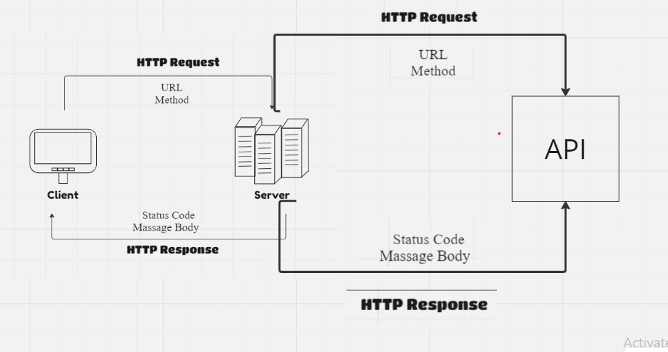

<!-- Project Name - Project Version -->
# Movies-Library - v1.0

<!-- Author Name -->
* Ragahd Al-Katout

<!-- WRRC -->
## WRRC


<!-- 
<!-- WRRC Example -->
<!-- * WRRC Example:
 --> 

## Overview 
    This project is a movie app that allows users to check the latest movies based on categories.


## Getting Started
<!-- The steps that a user must take in order to build this app on their own machine and get it running -->
To run this project locally, follow these steps:

1. clone the repository:
    ```
    git@github.com:Raghadkatout08/Movies-Library.git
    ```

2. Open VS Code.

3. Initialize the project:
    ``` 
    npm install
    ```
4. Run to Your server  ``` node server.js``` 


## Project Features
<!-- The features included in this app -->

```Movie Library app displays the latest movie releases. Users can explore in-depth details about movies like “Spider-Man” Including title, path and overview. In addition, the app provides a personalized and enjoyable user journey through their favorite content.```